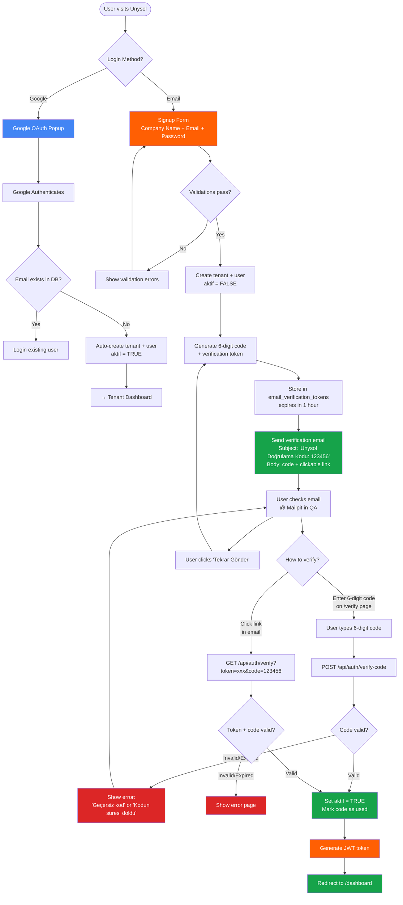

# Unysol — Registration Flow (Mermaid)



---

## Flow Summary

| Step | Google OAuth | Email/Password |
|------|:---:|:---:|
| Tenant creation | Auto | During signup |
| Email verification | Skipped | Required |
| 6-digit code | N/A | Sent in email subject + body |
| Code expiry | N/A | 1 hour |
| Auto-login after verify | N/A | Yes — JWT returned |
| First screen | Dashboard | Dashboard |

---

## API Endpoints

| Method | Path | Auth | Purpose |
|--------|------|:---:|---------|
| POST | `/api/auth/signup` | Public | Create tenant + user, send code |
| POST | `/api/auth/login` | Public | Login (blocks if unverified) |
| POST | `/api/auth/google` | Public | Google OAuth (auto-activates) |
| GET | `/api/auth/verify` | Public | Verify via link (token + code) |
| POST | `/api/auth/verify-code` | Public | Verify via 6-digit code |
| POST | `/api/auth/resend-code` | Public | Resend verification code |

## Email Template

```
Subject: Unysol — Doğrulama Kodunuz: 123456

Merhaba,

Unysol hesabınızı doğrulamak için:

Doğrulama Kodunuz: 123456

Veya aşağıdaki linke tıklayın:
http://localhost/verify?token=abc123...&code=123456

Bu kod 1 saat süreyle geçerlidir.

Saygılarımızla,
Unysol Ekibi
```
